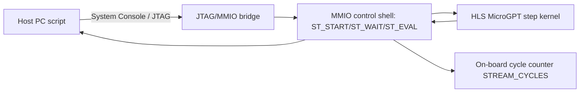
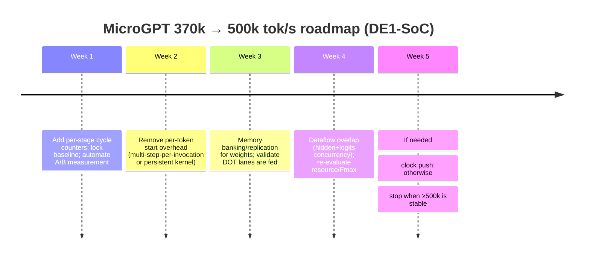

# MicroGPT Throughput Deep Dive: 370k → 500k tokens/sec

## Executive summary

Your current verified baseline is **370,538 tokens/sec** on a **DE1‑SoC**, measured with `.\run_inference.bat --count 100 --steps 15 --temperature 0.5`, generating **539 tokens** in **72,732 board cycles** (with reported core time 0.001455 s). fileciteturn2file0L5-L23 That measurement is based on an **on-board cycle counter**, not host-side printing speed. fileciteturn2file0L260-L273

At the board’s 50 MHz reference used in the throughput formula, that baseline corresponds to about **135 cycles/token** (72,732 / 539). fileciteturn2file0L15-L20 Reaching **500k tok/s** at the same 50 MHz implies **≤100 cycles/token**, meaning you need roughly a **1.35×** speedup overall (or a mix of fewer cycles/token plus a higher clock). fileciteturn2file0L268-L270

Two “obvious knob” trials have already been tested in hardware and regressed badly: `HIDDEN_ROW_PAR=2` dropped throughput to ~269k tok/s, and `LOGIT_ROW_PAR=3` dropped to ~264k tok/s. fileciteturn2file0L274-L318 So the best path to 500k is not “turn up row parallelism again”, it’s a sequence of **structural** optimizations:

- **Cut per-token invocation and control overhead** (MMIO state machine and HLS component start/done cadence), which is commonly a throughput killer in “many small steps” workloads (GPU analog: CUDA Graphs are explicitly used to reduce launch overhead). fileciteturn2file0L343-L348 citeturn6search6turn6search4  
- **Fix memory-system throughput** so your unrolled/lane DOTs are never starved (banking/replication to get more effective read ports). citeturn8search10turn7search1  
- **Overlap independent compute phases** (in your kernel, logits do not depend on `hidden_next`, only on `x_vec`) using a dataflow-style split, even if it costs extra hardware. fileciteturn2file0L213-L219 citeturn8search2  
- If needed, add a controlled **frequency push** (PLL / timing closure) or, since you said latency is not constrained, **multi-stream batching via replication** (multiple step engines in parallel) to exceed 500k as aggregate throughput.

The final recommended path (detailed later) is: **instrument → remove per-token start overhead → memory banking/replication for weights → dataflow overlap of hidden+logits → frequency push if still short**.

## Baseline understanding and where the cycles likely go

Your current hardware kernel is a **stateful, one-token-at-a-time** MicroGPT step implemented in HLS and wrapped by an MMIO controller with states `ST_IDLE`, `ST_START`, `ST_WAIT`, `ST_EVAL`. fileciteturn2file0L231-L253

The active kernel constants are very small (which is great for experimentation): `EMBED_DIM=16`, `VOCAB_SIZE=27`, `DOT_LANES=4`, `HIDDEN_ROW_PAR=1`, `LOGIT_ROW_PAR=2`. fileciteturn2file0L196-L212 The per-token flow is:

1) build `x_vec` from embeddings and prior hidden state  
2) compute `hidden_next` via `g_wq_q[row] dot x_vec`  
3) compute logits via `g_lm_q[row] dot x_vec` while tracking top-1/top-2  
4) sample in hardware, commit `hidden_next`, return token and metadata fileciteturn2file0L213-L223

Because everything is tiny, **raw math is unlikely to be the only limiter**. In this regime, you often become dominated by:

- **component start/done latency** and state-machine “bookkeeping” between tokens, which you already flagged as a next investigation area fileciteturn2file0L343-L348  
- **memory port limits / arbitration**: lane-unrolled dot products only help if the compiler can actually deliver `DOT_LANES` parallel weight reads each cycle; this is exactly where banking/replication matters (more read ports → fewer stalls). citeturn8search10turn7search0  
- **scheduling quirks** where HLS meets II constraints: the initiation interval (II) is the cycle gap between successive loop iterations; forcing II=1 is only meaningful if there are no loop-carried dependencies or memory-port conflicts. citeturn7search1turn7search8  
- **overheads that don’t scale with model size** (control, small LUT logic, interface handshakes), which become visible only when the “real compute” is small.

A practical takeaway explicitly written in your baseline note is that the “next-row-parallelism knobs” have been tried and should not be the starting point again; instead, focus should move to **control/state overhead**, **HLS scheduling overhead**, **dot-product structure changes that preserve the good macro-shape**, and **ROM/memory access structure**. fileciteturn2file0L339-L348

image_group{"layout":"carousel","aspect_ratio":"16:9","query":["Terasic DE1-SoC board","Intel Cyclone V SoC FPGA DE1-SoC","DE1-SoC JTAG header"],"num_per_query":1}

Here’s a simple mental model of the current pipeline. (This is not claiming your RTL is exactly this; it’s the conceptual flow your note describes.) fileciteturn2file0L231-L273



## What the broader literature says about boosting tok/s and which parts map to MicroGPT

Even though your *current* DE1‑SoC implementation is not a full modern Transformer (no KV-cache-heavy attention path is visible in the kernel description), the “throughput playbook” for GPT-like inference is still useful because the same bottlenecks recur: **memory movement, kernel launch/control overhead, and keeping compute units fed**. fileciteturn2file0L213-L223

The table below summarizes high-leverage techniques and the *reported* gains in their original contexts. Where a technique is mostly relevant to large Transformers, I call that out explicitly.

| Technique family | Core idea | Typical throughput impact reported in primary sources | Trade-offs | Primary sources |
|---|---|---|---|---|
| FlashAttention / FlashAttention‑2 | Make attention IO-aware by tiling into SRAM/shared memory to reduce HBM traffic, improving attention kernel efficiency | FlashAttention reports large end-to-end and kernel-level speedups (for example, multi× speedups in some GPT‑2 seq‑len regimes), and FlashAttention‑2 reports ~2× over FlashAttention in some settings and substantially higher FLOPs utilisation | Mostly GPU-focused; benefit depends on seq length, head dims; integrates at attention kernel level | citeturn0search0turn0search1turn0search12 |
| PagedAttention + continuous batching (vLLM) | Treat KV cache like paged virtual memory to reduce fragmentation, then continuously batch requests to keep GPU busy | vLLM paper positions this as enabling high-throughput serving with near-zero KV waste; vLLM docs highlight continuous batching and CUDA/HIP graphs for fast execution | Primarily serving-oriented; complexity in scheduler/memory manager | citeturn0search2turn0search6turn6search2 |
| TensorRT‑LLM style fused kernels + inflight batching | Aggressively fuse attention/MLP kernels, do inflight (continuous) batching, manage KV paging, add low-precision quantization modes | TensorRT‑LLM explicitly bundles custom attention kernels, inflight batching, paged KV cache, multiple quantization modes, and speculative decoding | NVIDIA GPU ecosystem; more build/deploy complexity than pure PyTorch | citeturn9view1turn0search7turn3search18 |
| DeepSpeed Inference + FastGen (SplitFuse) | Kernel injection + system techniques for transformer inference; FastGen introduces Dynamic SplitFuse (prompt+gen composition) | DeepSpeed‑FastGen reports up to **2.3× higher effective throughput** vs state-of-the-art systems in their eval (workload-dependent) | Serving-system complexity; depends on traffic mix and scheduler | citeturn3search1turn3search8 |
| Speculative decoding | Use a small “draft” model to propose multiple tokens, verify with the large model, producing identical output distribution while reducing serial steps | Speculative decoding paper demonstrates **~2×–3× acceleration** in their experiments | Requires draft model + verification logic; gains depend on acceptance rate | citeturn3search3turn3search7 |
| INT8 with outlier handling (LLM.int8) | Int8 matmul for most values, keep outlier features in higher precision to preserve accuracy | Enables int8 inference without accuracy loss in their setting, reducing memory footprint (a key enabler for throughput when memory-bound) | Kernel support needed; hardware-specific performance varies | citeturn1search0turn1search4 |
| SmoothQuant (W8A8) | Move activation outliers into weights via a mathematically equivalent transform, enabling INT8 activations and weights | Reports up to **~1.56× speedup** and **~2× memory reduction** in their evaluations | Calibration step; speedup depends on INT8 kernel quality | citeturn1search3turn1search7 |
| GPTQ (3–4 bit weight PTQ) | One-shot post-training weight quantization using approximate second-order information | Paper reports end-to-end inference speedups over FP16 of **~3.25×** (A100) in their benchmarks | Quantization time; accuracy risk if miscalibrated; kernel/packing required | citeturn1search1turn1search5 |
| AWQ (INT4 weight-only) | Protect salient weight channels by activation-aware scaling, keeping kernels hardware friendly | AWQ introduces weight-only 4-bit quant and reports large speedups in their TinyChat framework (for example, >3× over HF FP16 in their framing) | Weight-only helps most when decode is bandwidth-bound; needs packing + kernels | citeturn1search2turn1search10 |
| Kernel fusion (FFN/Transformer blocks) | Fuse multiple GEMMs + pointwise ops into fewer kernels to reduce memory traffic and launches | Recent work argues memory-bound kernels limit throughput and proposes aggressive fusion; modern inference stacks increasingly build around fusion | Harder debugging; compiler/runtime coupling; sometimes less flexible | citeturn5search3turn2search1turn2search0 |
| Compiler stacks (Triton, TVM, XLA, torch.compile) | Generate specialised kernels and fuse graphs to reduce overhead and increase utilisation | TVM and Triton are designed to produce performance-competitive kernels; XLA optimises graph regions across ops; PyTorch AOTInductor/torch.compile compiles graph regions for speed | Compile time, graph breaks, tuning effort | citeturn2search1turn2search8turn2search2turn6search1 |
| Tokenization and CPU-side bottlenecks | At high serving throughput, CPU preprocessing (tokenization) can stall the GPU unless parallelised/pipelined | OpenAI’s `tiktoken` reports being **3–6× faster** than a comparable tokenizer; vLLM community issues note tokenization/preprocessing can bottleneck throughput | Engineering overhead: process pools, pre-tokenization, batching | citeturn12search2turn12search1turn12search3 |
| Low-precision formats on modern accelerators | FP8 (and newer FP4 variants on newer GPUs) increase matmul throughput and reduce memory | NVIDIA positions FP8 via Transformer Engine as a throughput enabler on H100-class GPUs | Needs FP8-capable HW + recipe; may change numerical behaviour | citeturn4search1turn4search0turn4search5 |
| Linear / approximate attention variants | Change the *model* to use sub-quadratic attention mechanisms | Linformer and Performer propose linear-time/space approximations with competitive results in their evaluations | Model change and retraining; may reduce quality in some tasks | citeturn11search0turn11search1 |

### How this maps to your DE1‑SoC MicroGPT kernel

- **“Paged KV cache”, FlashAttention, etc.**: these matter if MicroGPT is a real Transformer with KV caches. Your current on-board kernel description looks more like a compact recurrent-ish step plus logits rather than a multi-layer self-attention stack. fileciteturn2file0L196-L223 If your “real MicroGPT” elsewhere is Transformer-shaped, these techniques become directly relevant. citeturn0search2turn0search0  
- **Launch/control overhead** is relevant everywhere. On GPUs, CUDA Graphs exist largely to reduce repeated launch overhead and improve utilisation in “many small kernels” workloads. citeturn6search6turn6search4 On your FPGA, the analogous enemy is “per-token component invocation + state machine sequencing”. You already identified that as a next investigation target. fileciteturn2file0L343-L348  
- **Memory feeding the compute** is universal. If your DOT lanes are unrolled but your ROM/BRAM cannot supply enough weights per cycle, you stall. Intel’s HLS documentation explicitly describes creating **memory banks/replicates** to get more read ports and faster access for many reads. citeturn8search10  
- **Dataflow overlap** is a good fit because (per your own per-token description) logits depend on `x_vec` and weights, not on `hidden_next`. So a split that computes hidden and logits concurrently can reduce critical-path cycles/token at the cost of extra hardware. fileciteturn2file0L213-L223 citeturn8search2  

## Prioritized incremental roadmap to reach 500k tok/s

This roadmap is intentionally incremental and benchmark-driven. The “uplift” numbers for FPGA steps are **estimates** (ranges) because your actual HLS schedule, memory mapping, and Fmax constraints will decide the real outcome. The literature-backed speedups (quantization, speculative decoding, etc.) are included separately above and are more predictive for GPU/CPU Transformer deployments. citeturn1search1turn3search3turn1search3

### Target math checkpoint

If you keep the 50 MHz reference and want 500k tok/s, you need to move from ~135 cycles/token to **100 cycles/token** or better. fileciteturn2file0L15-L20

| Quantity | Baseline | Target | Notes |
|---|---:|---:|---|
| Board clock used in formula | 50,000,000 Hz | 50,000,000 Hz | Throughput computed as `tokens_generated / (board_cycles / 50_000_000)`. fileciteturn2file0L268-L270 |
| Cycles/token (from baseline run) | ~134.94 | ≤100 | 72,732 cycles / 539 tokens. fileciteturn2file0L15-L20 |
| Throughput | 370,538 tok/s | ≥500,000 tok/s | 1.35× overall improvement. fileciteturn2file0L19-L20 |

### Step-by-step plan (DE1‑SoC on-board path)

| Step | What you implement | Why it helps | Est. uplift (tok/s) | Complexity | Key risks | “Go/No-go” measurement |
|---|---|---|---:|---|---|---|
| Instrument first | Add per-stage cycle counters (or done-cycle timestamps) for: build `x_vec`, hidden matvec, logits matvec, sampler, and MMIO overhead | You can’t reliably optimise what you can’t attribute; current note already points at control + scheduling + ROM access as next suspects | 0% (enabler) | Low | Extra counters perturb timing slightly | You can report per-stage cycle breakdown alongside total `STREAM_CYCLES`. fileciteturn2file0L343-L348 |
| Reduce per-token control overhead | Convert “one token per component start” into **multi-step-per-start** (run N tokens in one kernel call), or a **persistent kernel** that streams tokens until told to stop | Removes repeated start/done and state transitions; this is the FPGA analogue of reducing per-step launch overhead (CUDA Graphs exist for this exact kind of overhead on GPUs) | +5% to +20% | Medium | Harder debug; new corner cases around stop/reset; may require MMIO protocol changes | Total cycles/token drops even when compute stages are unchanged. fileciteturn2file0L231-L253 citeturn6search6 |
| Fix weight ROM bandwidth | Bank/replicate weight memories so lane-unrolled DOTs get enough read ports; ensure the compiler does not serialize reads | Intel HLS docs note memory replicates increase read ports and improve access when you have many reads | +5% to +25% | Medium | Higher BRAM/LUT usage; may reduce Fmax if routing worsens | Your per-stage counters show fewer stalls in matvec phases; HLS schedule shows fewer memory wait states. citeturn8search10turn7search1 |
| Dataflow overlap: hidden + logits | Split kernel into concurrent tasks (hidden engine + logits engine) driven by shared `x_vec`, potentially duplicating the dot-product engine | In your flow, logits depend on `x_vec`, not `hidden_next`, so these phases can run in parallel if you provision hardware; dataflow pragmas are specifically intended to overlap loops/functions | +10% to +35% | High | Consumes more DSPs/BRAM; could drop Fmax and erase gains | Cycles/token falls meaningfully; stage counters show overlap (sum of stages exceeds total). fileciteturn2file0L213-L223 citeturn8search2 |
| DOT micro-architecture tuning without changing row-par | Try DOT_LANES=8 **only if** memory banking supports it; also consider weight packing to match memory layout | If your design is compute-limited after fixing control/memory, more lanes can reduce dot latency; but only if fed | +0% to +20% | High | Your own history shows “seemingly good” cycle-model ideas can regress on real hardware; Fmax collapse is common | Must not decrease throughput; measure end-to-end only. fileciteturn2file0L295-L300 |
| Frequency push (PLL / timing closure) | Raise kernel clock while maintaining functional correctness | Throughput scales ~linearly with clock if cycles/token unchanged | +10% to +35% | Medium-High | Timing closure; need to update measurement formula if clock changes | Confirm Fmax and re-derive tok/s from measured clock and cycles. fileciteturn2file0L268-L270 |
| If latency truly doesn’t matter: replicate cores | Instantiate 2+ MicroGPT engines and run multiple sequences in parallel (batch in hardware) | Aggregate tok/s scales with number of parallel engines if memory/control allow; easiest way to exceed 500k aggregate | +100% (2×) possible | High | Area/BRAM limits; host protocol changes; measuring “aggregate tok/s” consistently | Define throughput metric clearly: total tokens across all streams / time. fileciteturn2file0L260-L273 |

### Mermaid view of the incremental timeline



## Microbenchmarks to run and how to measure gains cleanly

### On-board FPGA benchmarking (your current harness)

Your baseline command and metrics are already well-defined: `.\run_inference.bat --count 100 --steps 15 --temperature 0.5`, with the board reporting `STREAM_CYCLES` and the host computing throughput as `tokens_generated / (board_cycles / 50_000_000)`. fileciteturn2file0L7-L21 fileciteturn2file0L260-L270

To make optimisation work less noisy and more diagnostic:

1) **Report cycles/token directly** in the host script (it is the most stable unit when playing with clocks). This uses the same cycle counter you already trust. fileciteturn2file0L260-L273  
2) Sweep `--steps` over a wide range (e.g., 1, 2, 4, 8, 16, 32, 128) to separate **fixed overhead per run** from **steady-state per-token** cost, since fixed overhead amortises away at long runs. fileciteturn2file0L260-L273  
3) Run paired A/B tests with identical seeds and prompts. Your kernel is stateful (`hidden_state` inside the HLS component) and has `clear_cache` semantics, so make sure you always reset consistently between runs. fileciteturn2file0L224-L229  

**Suggested FPGA microbench “matrix”** (same board, same bitstream family):
- Baseline: `--steps 15` (current) plus `--steps 128` (steady-state) fileciteturn2file0L9-L21  
- Control-overhead test: `--steps 1` and `--steps 2` to magnify per-invocation overhead fileciteturn2file0L260-L273  
- Sampler cost test: temporarily force greedy/argmax (no stochastic sampling) to measure sampler impact, but treat this as a diagnostic since it changes behaviour fileciteturn2file0L213-L223  
- Memory stress test: pad weights/vectors to change banking patterns and see if stalls shift, which is a common way to confirm “memory-port limited” behaviour citeturn8search10  

### Measurement methodology checklist (so you don’t chase ghosts)

- Always compare **end-to-end** throughput from the same on-board counter, because you’ve already observed that local cycle models can overpredict and real hardware can regress. fileciteturn2file0L295-L300  
- When you change clocks, update the denominator in the throughput formula or report both (cycles/token and tok/s) so you stay honest about what changed. fileciteturn2file0L268-L270  
- Keep the optimisation target clear: since you said latency constraints are not specified, optimise for **aggregate tok/s**, but still track **µs/tok** so you can detect accidental slowdowns hidden by batching tricks. fileciteturn2file0L19-L20  

### If you also benchmark CPU and GPU options (useful as a sanity backstop)

Because you asked to list hardware targets and compilation stacks, here’s a practical way to benchmark on modern NVIDIA GPUs with minimal ambiguity: use **TensorRT‑LLM’s** provided tooling.

TensorRT‑LLM provides `trtllm-bench` specifically for reproducing published performance and benchmarking flows and features. citeturn10view0turn9view1 It also explicitly recommends GPU-side setup steps like enabling persistence mode and managing clocks and power limits for reproducible benchmarking. citeturn10view0

Example snippets straight from their benchmarking guidance (Linux):

```bash
sudo nvidia-smi -pm 1          # persistence mode
sudo nvidia-smi -rgc           # reset GPU clocks
nvidia-smi -q -d POWER         # query max power
sudo nvidia-smi -pl <max>      # set max power limit
```

Those steps are recommended to reduce variability when doing performance comparisons. citeturn10view0

For inference serving systems, also track standard metrics like throughput, inter-token latency, and time-to-first-token (TTFT). citeturn12search19

## Configuration tables: hardware, precision, batch/sequence knobs

You asked for options across CPUs, single/multi-GPU, accelerators (A100/H100/TPU/Apple Silicon), plus batch sizes, sequence lengths, and precision modes. Since MicroGPT’s “real” size is unspecified, the right way to read this section is: **which knobs usually move tok/s the most, and where they apply**.

### Hardware target options (what each is good at)

| Target | Where it shines for tok/s | Common constraints | Sources |
|---|---|---|---|
| FPGA dev boards (like DE1‑SoC) | Deterministic pipelines, custom datapaths, can eliminate software overhead entirely | Tight on-chip memory/ports; Fmax and routing are often the limiter; design effort is high | Your current baseline and optimisation history. fileciteturn2file0L5-L23 |
| NVIDIA GPU (A100/H100 class) | Very high matmul throughput; libraries like TensorRT‑LLM focus on fused kernels, inflight batching, paged KV cache, quantization, speculative decoding | Best throughput usually requires batching/serving runtime; careful memory management and NUMA/host tuning in multi-GPU nodes | citeturn9view1turn0search7turn13view0 |
| Google Cloud TPU (v5e / v5p) | Purpose-built matrix units, strong BF16/INT8 pipelines; scalable pods | Often needs XLA/JAX/TF stack and TPU-specific deployment model | citeturn4search3turn4search7turn4search22 |
| Apple Silicon (M-series / ANE) | On-device inference efficiency; Core ML tooling; strong integrated memory system | Kernel/library constraints; model format constraints; peak tok/s depends heavily on quantization and operator coverage | citeturn4search2turn4search6 |
| CPU-only (x86/ARM servers) | Simpler ops, easy deployment; can be cost-effective for small models and high batching | Token generation often memory-bandwidth limited; needs good INT8/INT4 kernels and threading | Memory-bandwidth themes and quantization benefits are central in AWQ/SmoothQuant/LLM.int8. citeturn1search2turn1search3turn1search0 |

### Precision and quantization choices (throughput vs risk)

| Mode | When it boosts tok/s most | Notes | Sources |
|---|---|---|
| FP16 / BF16 | Default fast path on GPUs; good balance of speed and quality | Often baseline for GPU inference stacks | Mentioned across TensorRT‑LLM, DeepSpeed, FlashAttention ecosystems. citeturn9view1turn3search8turn0search0 |
| FP8 (H100+) | When matmuls dominate and FP8 kernels are available | NVIDIA’s Transformer Engine positions FP8 as a throughput enabler on H100-class GPUs | citeturn4search1turn4search0turn4search5 |
| INT8 (W8A8) | When decode becomes bandwidth limited and good INT8 kernels exist | SmoothQuant specifically targets making W8A8 work well by handling activation outliers | citeturn1search3turn1search7 |
| Mixed INT8 with outlier handling | When you need int8 memory savings but can’t tolerate accuracy loss | LLM.int8 isolates outlier features to higher precision while keeping most ops in int8 | citeturn1search0turn1search4 |
| INT4 weight-only (AWQ) | When weights bandwidth is the bottleneck (common in decode) | Needs weight packing + kernels; accuracy depends on calibration | citeturn1search2turn1search10 |
| 3–4 bit PTQ (GPTQ) | When you can afford PTQ time and have kernels | GPTQ reports multi× speedups in their end-to-end benchmarks vs FP16 in some settings | citeturn1search1turn1search5 |

### Batch size and sequence length: the knobs that move throughput

- **Increasing batch size (number of concurrent sequences)** is usually the fastest way to raise *aggregate* tok/s on GPUs and servers, especially when you have no latency constraint. Serving engines do this with continuous or inflight batching. citeturn6search2turn9view1  
- **Sequence length** largely affects attention/KV cache costs in real Transformers; specialised attention kernels and KV cache management (FlashAttention, PagedAttention) exist because longer sequence lengths stress memory and IO. citeturn0search0turn0search2turn0search6  
- **Decoding strategy** matters: beam search increases compute proportional to beam size and is empirically slower than greedy in many settings; one study reports beam search slower by ~1.13×–1.41× than greedy. citeturn6search11turn6search3  
- **CPU-side preprocessing** can cap throughput at high concurrency: tokenization has been reported to bottleneck pipelines, and `tiktoken` reports being several times faster than comparable tokenizers. citeturn12search2turn12search1  

## Final recommended path to hit 500k tok/s

This is the pragmatic path I’d run, assuming the goal is **real, end-to-end on-board tok/s**, using your existing measurement mechanism, and without revisiting the row-parallelism changes that already regressed. fileciteturn2file0L274-L318

### Recommendation

1) **Stage attribution first (1 day to a few days)**  
   Add per-stage counters and separate “MMIO overhead” from “kernel steady-state cycles”. The goal is to answer one question: *are we dominated by compute loops or by start/control/memory stalls?* Your own note already points to control overhead and ROM/memory structure as next suspects, so instrumentation directly serves that. fileciteturn2file0L343-L348

2) **Remove per-token start/done overhead (likely the best ROI)**  
   Implement multi-step-per-invocation or a persistent streaming kernel. If you can shave even ~15–25 cycles/token of “bookkeeping”, you’re a big fraction of the way to 100 cycles/token. This is the same class of optimisation as CUDA Graphs on GPUs, which exist to reduce repeated launch overhead and improve utilisation. citeturn6search6turn6search4

3) **Make sure DOT_LANES is real, not paper**  
   Use memory banking/replication so each DOT lane gets the reads it needs per cycle. Intel HLS documentation explicitly frames replicates/banks as the mechanism to create more read ports and faster access under many read operations. citeturn8search10  
   If your stage counters show matvec phases stalling, this step can be the difference between “II=1 in theory” and “II=1 in silicon”.

4) **Only if still short: overlap hidden and logits via dataflow split**  
   Since logits depend on `x_vec` (and not on `hidden_next`) according to your per-token description, you can compute them concurrently in principle by allocating hardware. fileciteturn2file0L213-L223  
   This is the highest-risk FPGA step because extra hardware can reduce Fmax and kill gains. But it is also the most plausible single change that can knock ~20–40 cycles/token off a ~135-cycle/token design if those phases are currently serialised.

5) **If you land around 430–470k tok/s and need the last push: frequency**  
   A modest clock increase (if timing allows) can bridge the remaining gap, but only after verifying the design is not already frequency-limited by routing introduced in earlier steps. Keep reporting cycles/token so you know if you’re improving architecture or just pushing clocks. fileciteturn2file0L268-L270

### Why this should get you to 500k

- You need ~35 fewer cycles/token at 50 MHz. fileciteturn2file0L15-L20  
- Cutting control/start overhead and fixing memory stalls are exactly the kinds of changes that can reclaim “dozens of cycles” in small-kernel designs. Your own note calls those out as next likely areas, and Intel HLS docs back the idea that memory replication/banking is how to get more read throughput. fileciteturn2file0L343-L348 citeturn8search10  
- If those two steps only get you partway, overlapping hidden+logits is the structural lever that changes the critical path rather than shaving corners. fileciteturn2file0L213-L223  

If you decide that “500k tok/s” can be **aggregate** and latency truly does not matter, then **replicating the kernel** to run multiple sequences in parallel is the fastest guaranteed route (2 engines at ~370k each already clears the goal). The main work then shifts from kernel cycles to MMIO/host protocol and on-chip resource budgets. fileciteturn2file0L196-L212